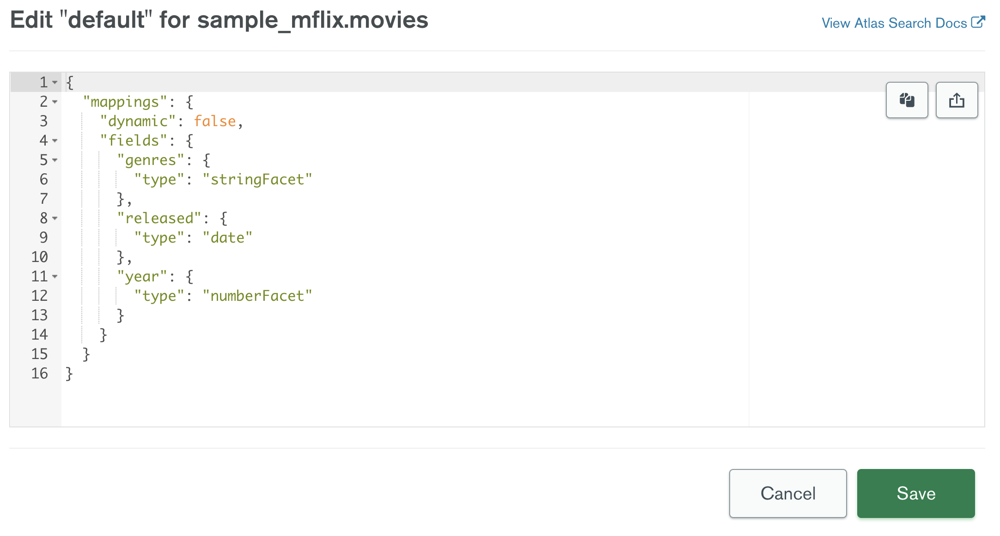
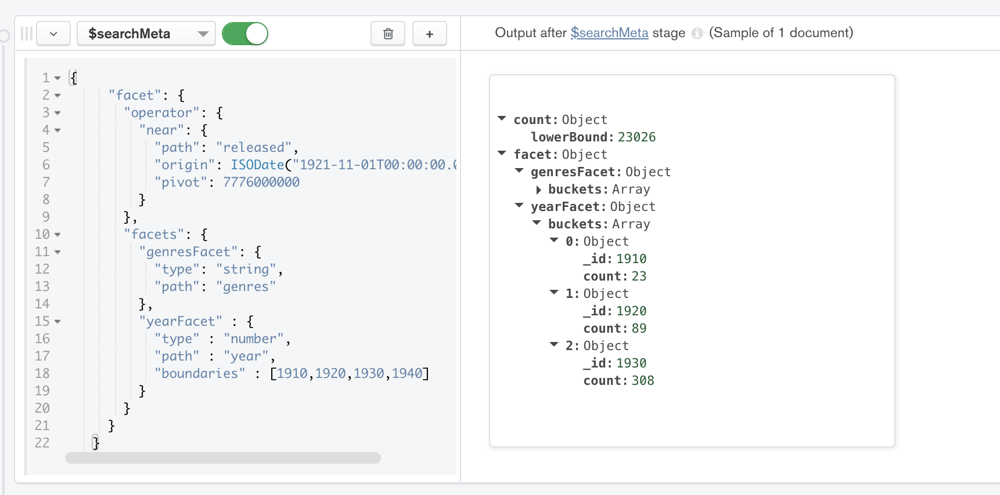

# FACETED-SEARCH

__Ability to bucket documents using Atlas Search Facets__

__SA Maintainer__: [Tom Gleitsmann](mailto:tom.gleitsmann@mongodb.com)  
__Time to setup__: 15 mins  
__Time to execute__: 5 mins  

---
## Description

This proof shows how MongoDB Atlas Search provides the ability to group movies documents into years and genres categories. The proof will be executed using only the Atlas UI, however the execution can be translated to a MongoDB Driver, Compass, or Mongo Shell. The _movies_ collection from the [Atlas sample_mflix database](https://docs.atlas.mongodb.com/sample-data/available-sample-datasets/#available-sample-datasets) will be used, and specifically the _released_ date will be queried against and the _genres_ and _year_ fields will be faceted against. 

---
## Setup
__1. Configure Laptop__

* Ensure the latest version of MongoDB Compass Enterprise __version 1.30.1__ (as of 03/24/2022) is installed on your laptop. The `$searchMeta` operator needs to be available on the version of Compass.

__2. Configure Atlas Environment__

* Log-on to your [Atlas account](http://cloud.mongodb.com) (using the MongoDB SA preallocated Atlas credits system) and navigate to your SA project
* In the project's Security tab, choose to add a new user called __main_user__, and for __User Privileges__ specify __Atlas admin__ (make a note of the password you specify)
* Also in the Security tab, add a new __IP Whitelist__ for your laptop's current IP address

* Create a __M20__ based 3 node replica-set in any cloud/region of your choice, running __MongoDB version 5.X__. Title the cluster _Facet-PoV_
* Once the cluster has been fully provisioned, in the Atlas console, click the **... (*ellipsis*)** for the cluster, select **Load Sample Dataset**. In the modal dialog, confirm that you want to load the sample dataset by choosing **Load Sample Dataset**
	
* In the Atlas console, once the dataset has fully loaded, click the __Collections button__ for the cluster, and navigate to the `sample_mflix.movies` collection. Under the __Search__ tab, choose to __Create Search Index__
* You can select either JSON Editor or Visual Editor
   
* For the Visual Editor:
	\
  * Select the _sample_mflix.movies_ namespace
  * Turn off Dynamic Mapping
  * Add field mappings for...
    * `genres` where dynamic mapping is off and the field type is set to `StringFacet`
    * `released` where dynamic mapping is off and the field type is set to `Date`
    * `year` where dynamic mapping is off and the field type is set to `NumberFacet`
  * select _Save Changes__

* For the JSON Editor:
	
  * Copy and Paste the index definition below for the _sample_mflix.movies_ namespace
  <pre>
    {
	   "mappings": {
	     "dynamic": false,
	     "fields": {
	       "genres": {
	         "type": "stringFacet"
	       },
	       "released":{
	         "type": "date"
	       },
	       "year": {
	         "type": "numberFacet"
	       }
	     }
	   }
    }
  </pre>
  * select __Create Search Index__

* The index creation process should take less than a minute.  Full-text search indexes are built in a rolling fashion, starting with the secondaries first.  You are able to view the progress and statistics of the cluster's primary node in the overview page:
   
* In the event that some nodes report a different status than the primary node, there is an option to [view the status of the index build on each node](https://docs.atlas.mongodb.com/reference/full-text-search/create-index/#node-status)
   

---
## Execution

__1. Configure Atlas Search Query within Compass__

* Grab the Compass connection string from the Atlas UI and open _MongoDB Compass_
* Within Compass, connect to your cluster and navigate to the _sample_mflix.movies_ namespace
* In the _aggregations_ tab create a `$searchMeta` stage
  * Since we will be using the default index, we can remove the `index: string` from the skeleton
  * Since we aren't going to be search against text but rather dates, we'll replace 
    `text: {
      query: string,
      path: string
     }`
    with 
    `near": {
       "path": "released",
       "origin": ISODate("1921-11-01T00:00:00.000+00:00"),
       "pivot": 7776000000
     }`
     where we'll be querying on the path _released_ for dates within _7776000000_ milliseconds (3 months) of the ISO Date _"1921-11-01T00:00:00.000+00:00"_
  * In the facets part of the skeleton we'll want to create facets for genres and year. 
    * Genres: 
      `"genresFacet": {
         "type": "string",
         "path": "genres"
       },`
    * Year: 
      `"yearFacet" : {
         "type" : "number",
         "path" : "year",
         "boundaries" : [1910,1920,1930,1940]
       }`
  * So we should be left with an aggregation stage on `$searchMeta` that looks like this: 
    <pre>
	{
     "facet": {
       "operator": {
         "near": {
           "path": "released",
           "origin": ISODate("1921-11-01T00:00:00.000+00:00"),
           "pivot": 7776000000
         }
       },
       "facets": {
         "genresFacet": {
           "type": "string",
           "path": "genres"
         },
         "yearFacet" : {
           "type" : "number",
           "path" : "year",
           "boundaries" : [1910,1920,1930,1940]
         }
       }
     }
   }
	</pre>
  * Feel free to copy and paste this aggregation instead

* The pipeline will automatically be executed and the result should now look similar to the following image:
    

---
## Measurement  

This proof should have demonstrated the ability to group fields within documents into categories using MongoDB Atlas Search Facets. See [Faceting Documentation](https://www.mongodb.com/docs/atlas/atlas-search/tutorial/facet-tutorial/) for more details

